# Profiler

Profiler is a lifestyle app for tracking users' calorie consumption and exertion on a day-to-day basis, including the ability to determine calorie value of food from images taken from users' devices.

## Features

* Calculate Calories from images of food
* Calculate BMI
* Track Calorie consumption information
* Track Exercise information

## Building

Clone the git repository and build the project using Android Studio.

## Calorie Calculator API

A  is used to run an API to identify the foods from image and estimate calorie.

## Screenshots

### Homepage
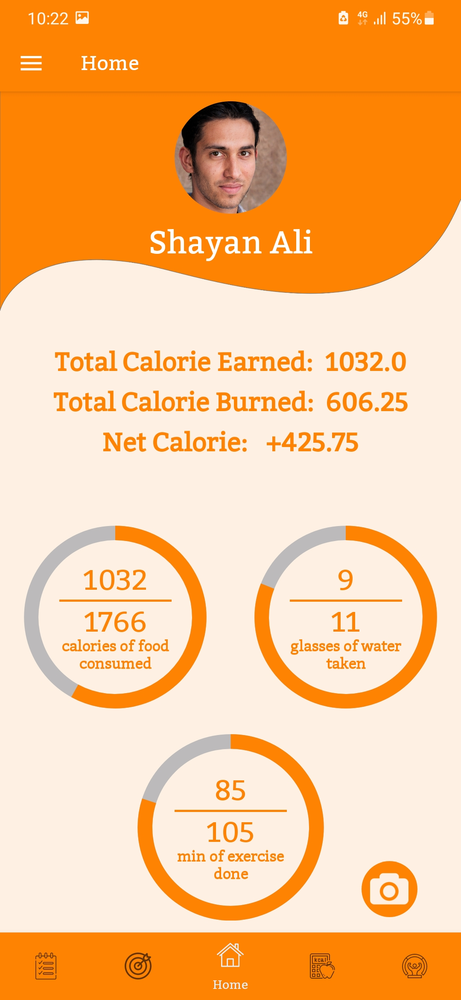  

### Calorie Calcultor
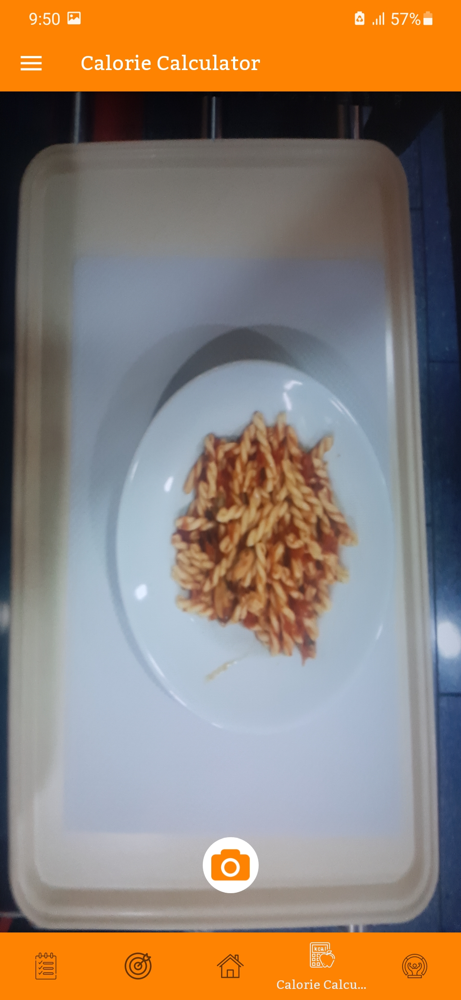
  

### Goal Tracker
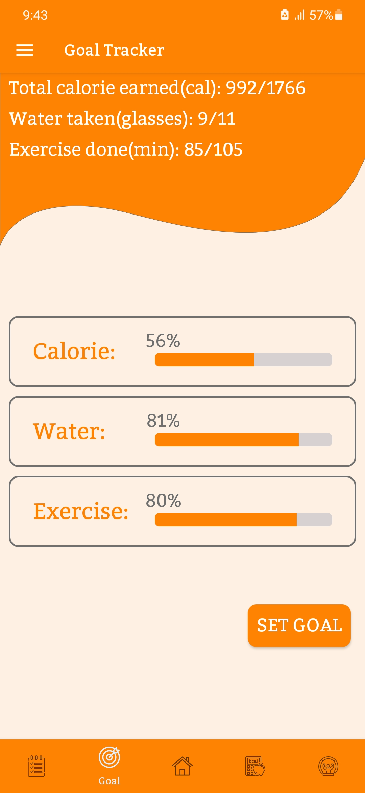
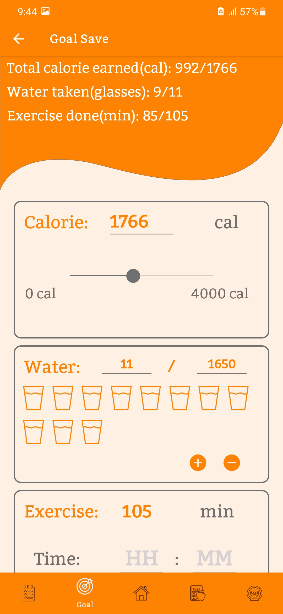
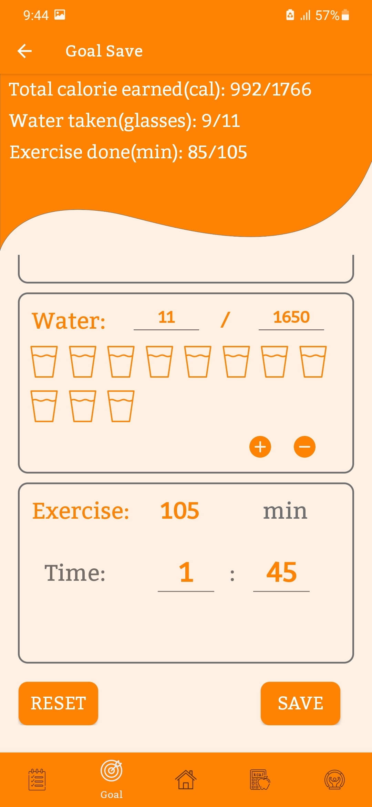  

### Daily Calorie Update
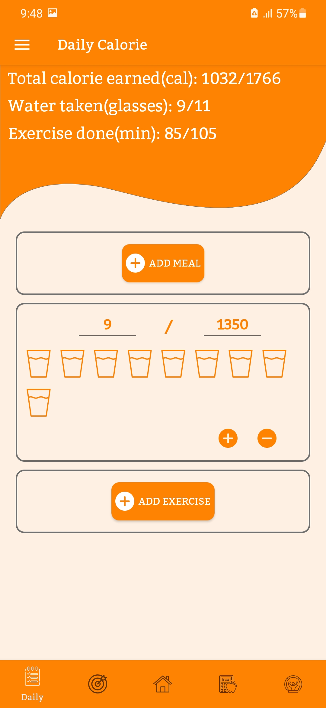
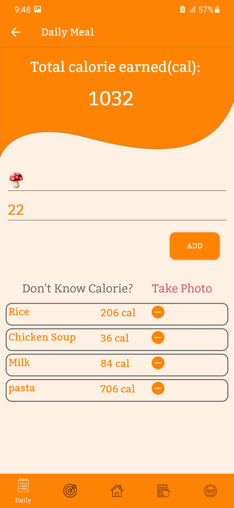
  

### BMI Calculator
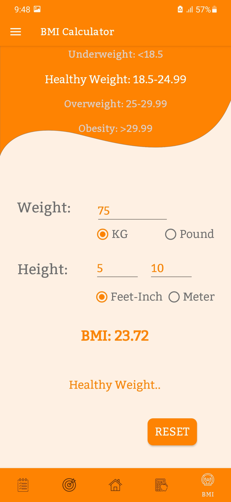  

### Side Navigaton Menu
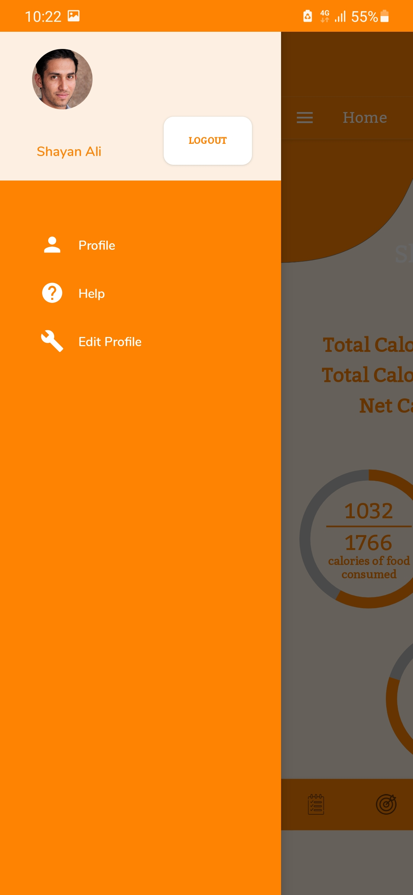 

### Profile

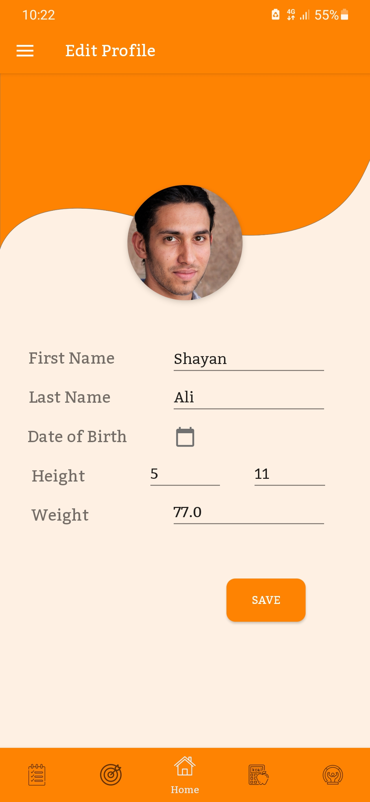 

### Documentation
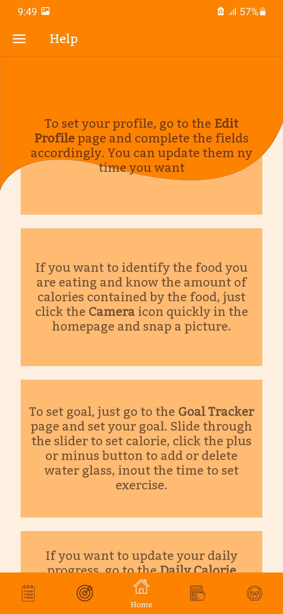
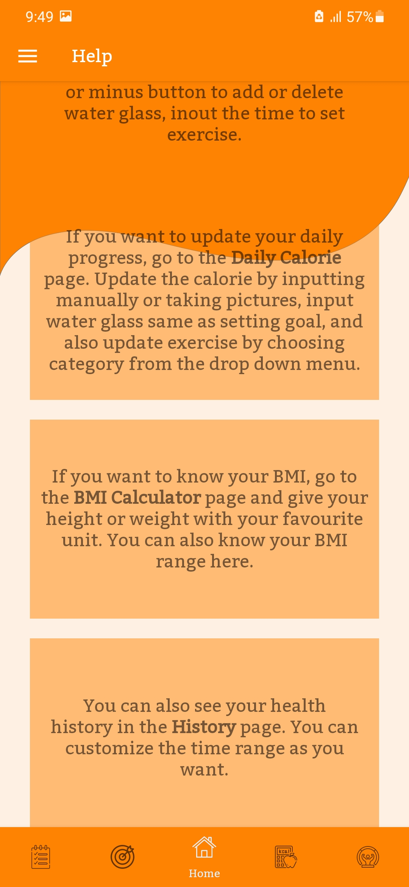

## Copyright

Project is licensed under the MIT license, see LICENSE for detailed information.
